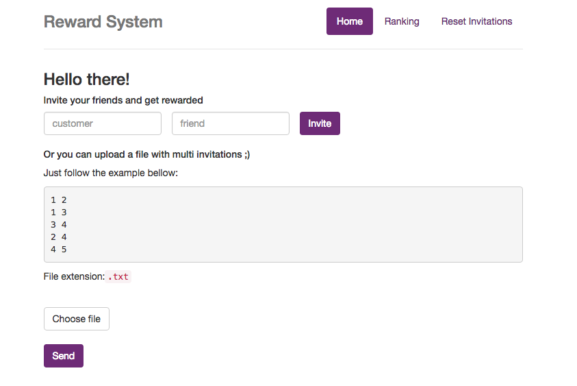
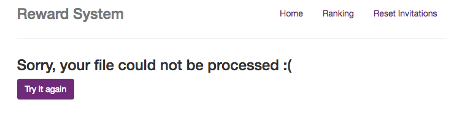
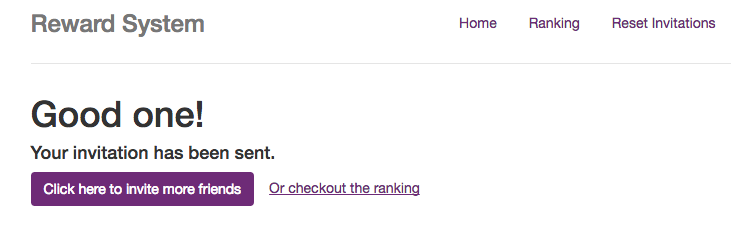
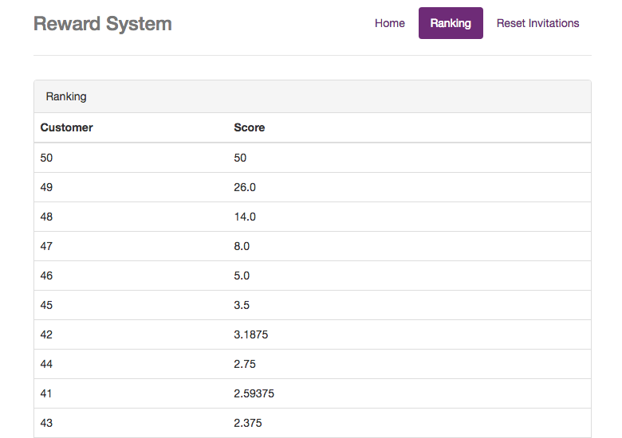

# Reward system
It is a reward system that will give customers points for each confirmed invitation they played a part into.

The solution is based on [sparse matrix](https://en.wikipedia.org/wiki/Sparse_matrix) and [directed graph](https://en.wikipedia.org/wiki/Directed_graph) concepts.
___

## Prerequisites

You will need Leiningen 2 installed. The code was developed & tested with these versions:

```
> lein --version
Leiningen 2.5.3 on Java 1.8.0_60 Java HotSpot(TM) 64-Bit Server VM
```
___
## Running

To start a web server for the application, run:
```
lein ring server
```

#### Home
You can invite your friends by inputing one by one or send a file that has all the invitations in it.



#### Error
In case your file isn't in the correct format an error might show up. Don't worry, you can fix it and try again.



#### Confirmation of your invite
All good? So now, you can go back where you were and invite more friends or see the ranking.



#### Ranking


#### Reset
It is also possible to reset the data.

___
## Testing

```
> lein test

lein test reward_system.core_test

lein test reward_system.handler_test

lein test reward_system.matrix_test

Ran 3 tests containing 53 assertions.
0 failures, 0 errors.
```
